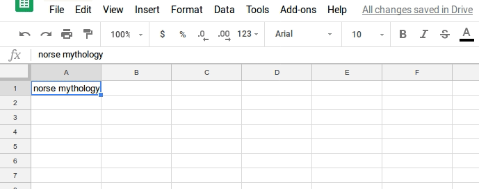

# Apps scripts
Google apps scripts I use.

## goodreads.gs
This script is used to populate title, author, number of pages, publication year, and genre(fiction or non-fiction). 
Tested for google sheets. Creates a new row with the queried information.

